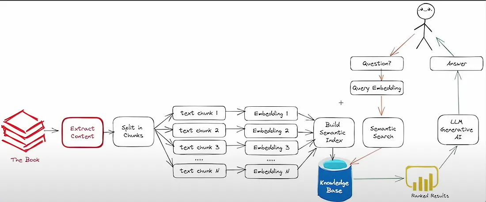

# RAG application
Retrieval-Augmented Generation (RAG) is the process of optimizing the output of a large language model, so it references an authoritative knowledge base outside of its training data sources before generating a response.

## Architecture

- Document Loading
    - WebScraping
    - Uploading documents 
- Embedding documents
    - Huggingface embedding model 
- Storing
    - Save into vector stores
- Retriever
    - Retrieve relevant docs of the user question using 'similarity_search' algorithm
- LLM
    - Any foundational model for generating the response from the user question with retrieved documents.

## Dependencies

- `os`: Provides functions for interacting with the operating system.
- `glob`: Offers a Unix-style path name pattern expansion.
- `langchain`: A library for text processing and vectorization.
- `HuggingFace` : Accessing the Embedding models.
- `rag`: A package for web scraping and text extraction.
- `bs4` : Formatting the HTML document.
- `requests`: A library for making HTTP requests.
- `warnings`: Allows for handling warning messages.
- `flask & CORS`: Allows to create end-point.
- `faiss`: Vector database which stores the embeddings.

## Get Started

The './rag' Python script defines a Flask web application for web scraping(extracts URLs) and text extraction, using the `LinkScraper` and `TextExtractor` classes from the `rag` package.

###  Input Documents
- Web scrapping
    - `/extract_link'`: Scrapes all the available URLs withe the limit of `max_urls` from the given URL `head_url` and save the extracted content in the documents/content.txt.
- Upload local documents
    - `/uploadDoc`:Upload the textual documents from the local machine (supported:.txt,.pdf,.docx,.csv,.json,.html).

### Document Chunking and Embedding

- `load_docs_and_save(directory)`: This method loads documents from a specified directory and saves their embeddings using `FAISS` vector db in the `faiss_index` directory for further processing.
- `get_embeddings()`: Gives the embeddings for the loaded documents based on the model from the config file.
- Here we can add and remove the documents and their embeddings.

### Generation
- There are two type of response generation.
    1) Response from the uploaded data(RAG).
        - `/generator()`: Generates a response to the user question by the relevant data from the loaded documents with the help of LLM.
    2) Response from the LLM trained data(Question answering) 
        - `llm()`: Gives the response based on the trained data.

- In this application LLM is hosted on the server and accessing it using endpoint(deployed model serverless using TGI image).

### Other APIs and Flask application
- `/getData`: This API displays the scrapped content to the user.
- `/remove_profile()`: This API removes the profile or document along with the embeddings.
- Uses CORS (Cross-Origin Resource Sharing) for handling requests from different origins.
- Runs the Flask application on `localhost` at port `8888` in debug mode.

<!-- Please note that the actual functionality of the code depends on the implementation details of the classes and functions from the `rag` and `langchain` packages. -->
## Additional features
### Pre-Retrievel
1) **Meta data integration:**
2) **Indexing structure:** 
    - Adding embeddings
    - Removal of embeddings
    - Updating the embeddings
### Post-Retrievel
1) **Re-ranking**
    - FlashRank Reranking, Ranker
## Get Started
 - Create any virtual environment(python -m venv env) and activate it
 - Install the requirements `pip install -r requirements.txt`
 - Run the `python rag_features.py` file and the server gets activated with the port `8888`.
 - The server will run with the localhost:8888 port which is linked to the UI.
 - Then upload the document from the local machine or get the data from web scrapping function by passing the URL with the UI.
 - Pass the questions related to uploaded documents or scrapped data in the textbox in which the expected response will be returned.
 - Then you can delete the embeddings/documents that you have uploaded in results you get the no response.  

